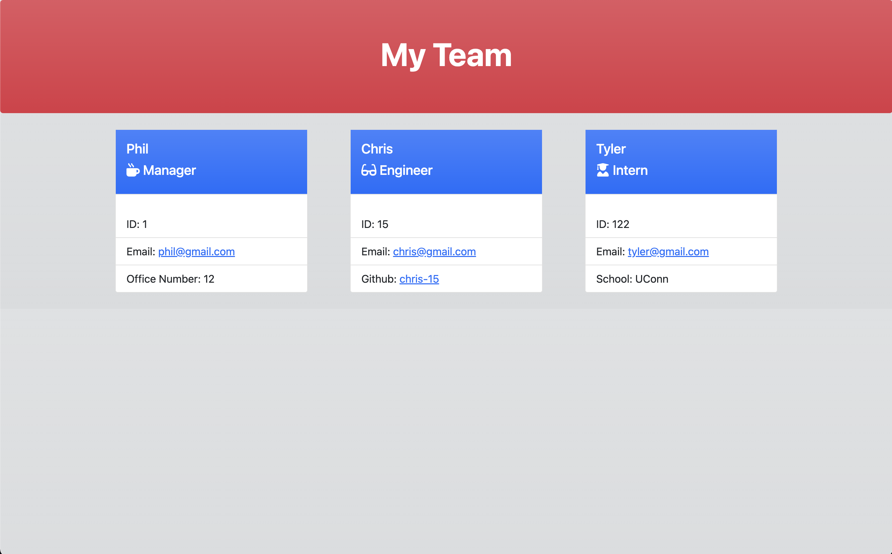

# ReadMe Generator- Weekly Challenge 9

  
  
 ## Table of Contents 
  - [Description](#description)
  - [Installation](#installation)
  - [Usage](#usage)
  - [Tests](#tests)
  - [Credits](#credits)
  - [License](#license)
  

## Description 

The purpose of this week's challenge was to create a command-line application that generated an HTML file based on user input for a Team Profile. Technologies used were Node.js, the inquirer package, and the jest package.

Below are the challenge requirements:

- GIVEN a command-line application that accepts user input
- WHEN I am prompted for my team members and their information
- THEN an HTML file is generated that displays a nicely formatted team roster based on user input
- WHEN I click on an email address in the HTML
- THEN my default email program opens and populates the TO field of the email with the address
- WHEN I click on the GitHub username
- THEN that GitHub profile opens in a new tab
- WHEN I start the application
- THEN I am prompted to enter the team manager’s name, employee ID, email address, and office number
- WHEN I enter the team manager’s name, employee ID, email address, and office number
- THEN I am presented with a menu with the option to add an engineer or an intern or to finish building my team
- WHEN I select the engineer option
- THEN I am prompted to enter the engineer’s name, ID, email, and GitHub username, and I am taken back to the menu
- WHEN I select the intern option
- THEN I am prompted to enter the intern’s name, ID, email, and school, and I am taken back to the menu
- WHEN I decide to finish building my team
- THEN I exit the application, and the HTML is generated 

 

A video of the application in use: 

[Demonstration Video](https://drive.google.com/file/d/1UeqAnSxU7rtXAmzVgPOAV1WeVJKMS9Ef/view?usp=sharing)

Below is a screenshot of the example HTML file genereated in the demonstration video:
 

 

## Installation

The user must install both Node.js and the inquirer package before use. The user must also install the jest package to run tests.

## Usage 

This application can be used to build a Team Profile webpage through a series of prompts in the command line. A sample Team Profile HTML page can be found in the dist folder.

## Tests

In order to run tests using jest, the user must use the command 'npm run test' in the command line.

## Credits

- AskBCS
- Various Classmates
- TA's
- [Node.js Documentation](https://nodejs.org/en/docs/)
- [Inquirer Documentation](https://www.npmjs.com/package/inquirer)
- [Jest Documentation](https://jestjs.io/docs/getting-started)

## License

MIT License

Copyright (c) [2022] [Christopher Sarmiento-Salas]

Permission is hereby granted, free of charge, to any person obtaining a copy
of this software and associated documentation files (the "Software"), to deal
in the Software without restriction, including without limitation the rights
to use, copy, modify, merge, publish, distribute, sublicense, and/or sell
copies of the Software, and to permit persons to whom the Software is
furnished to do so, subject to the following conditions:

The above copyright notice and this permission notice shall be included in all
copies or substantial portions of the Software.

THE SOFTWARE IS PROVIDED "AS IS", WITHOUT WARRANTY OF ANY KIND, EXPRESS OR
IMPLIED, INCLUDING BUT NOT LIMITED TO THE WARRANTIES OF MERCHANTABILITY,
FITNESS FOR A PARTICULAR PURPOSE AND NONINFRINGEMENT. IN NO EVENT SHALL THE
AUTHORS OR COPYRIGHT HOLDERS BE LIABLE FOR ANY CLAIM, DAMAGES OR OTHER
LIABILITY, WHETHER IN AN ACTION OF CONTRACT, TORT OR OTHERWISE, ARISING FROM,
OUT OF OR IN CONNECTION WITH THE SOFTWARE OR THE USE OR OTHER DEALINGS IN THE
SOFTWARE.